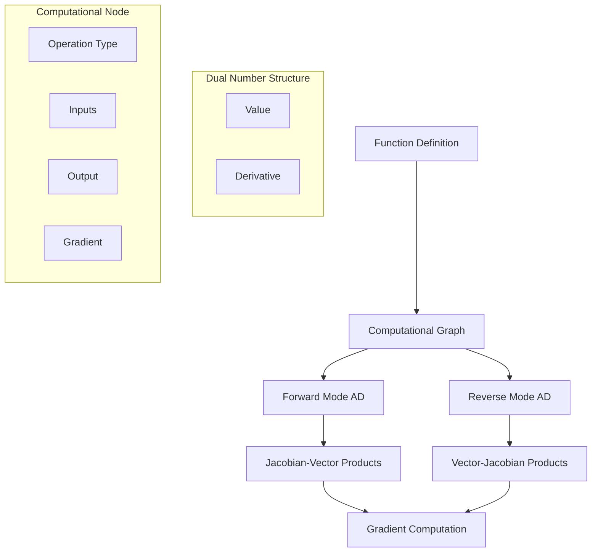

# Automatic Differentiation in Eshkol

## Overview of Automatic Differentiation

Eshkol provides built-in support for automatic differentiation (AD), a powerful technique for computing derivatives of functions efficiently and accurately. This capability is essential for gradient-based optimization, machine learning, and scientific computing.

### Core Concepts



## Forward-Mode and Reverse-Mode Differentiation

Eshkol supports both major approaches to automatic differentiation:

### Forward-Mode Differentiation

Forward-mode AD computes derivatives alongside function evaluation by propagating derivatives forward through the computation. It's implemented using dual numbers:

```c
typedef struct {
    float value;
    float derivative;
} DualNumber;

DualNumber dual_number_create(float value, float derivative) {
    DualNumber result;
    result.value = value;
    result.derivative = derivative;
    return result;
}
```

#### Example: Forward-Mode Differentiation

```scheme
;; Define a function and its derivative using forward-mode AD
(define (f x)
  (+ (* x x) (* 2 x) 1))

;; Compute f'(3) using forward-mode AD
(define df/dx (differentiate f))
(df/dx 3)  ; => 2*3 + 2 = 8
```

### Reverse-Mode Differentiation

Reverse-mode AD builds a computational graph and propagates derivatives backward from outputs to inputs. It's more efficient for functions with many inputs and few outputs:

```c
typedef struct ComputationalNode {
    NodeType type;
    struct ComputationalNode* inputs[MAX_INPUTS];
    size_t input_count;
    float value;
    float gradient;
} ComputationalNode;

static void compute_gradients_recursive(ComputationalNode* node) {
    if (!node) return;
    
    switch (node->type) {
        case NODE_CONSTANT:
            // Constants don't propagate gradients
            break;
            
        case NODE_VARIABLE:
            // Variables accumulate gradients
            break;
            
        case NODE_ADD:
            // Addition: gradient flows unchanged to inputs
            for (size_t i = 0; i < node->input_count; i++) {
                node->inputs[i]->gradient += node->gradient;
                compute_gradients_recursive(node->inputs[i]);
            }
            break;
            
        case NODE_MULTIPLY:
            // Multiplication: gradient scaled by other input
            node->inputs[0]->gradient += node->gradient * node->inputs[1]->value;
            node->inputs[1]->gradient += node->gradient * node->inputs[0]->value;
            compute_gradients_recursive(node->inputs[0]);
            compute_gradients_recursive(node->inputs[1]);
            break;
            
        // Other operations...
    }
}
```

#### Example: Reverse-Mode Differentiation

```scheme
;; Define a neural network loss function
(define (loss weights inputs targets)
  (let* ((predictions (forward-pass weights inputs))
         (errors (map - predictions targets))
         (squared-errors (map square errors)))
    (mean squared-errors)))

;; Compute gradients using reverse-mode AD
(define gradients (gradient loss weights))
```

## Integration with the Type System

Eshkol's automatic differentiation is deeply integrated with its type system:

```scheme
;; Type declaration for a differentiable function
(: optimize (-> (differentiable (-> (vector float) float)) 
                (vector float) 
                float 
                (vector float)))

;; Implementation using gradients
(define (optimize f initial-point learning-rate)
  (let* ((grad (gradient f))
         (step (vector-scale (grad initial-point) (- learning-rate))))
    (vector-add initial-point step)))
```

The `differentiable` type modifier indicates that a function can be automatically differentiated, enabling compile-time checks for differentiability.

## Applications in Machine Learning and Optimization

### Gradient Descent Optimization

```scheme
(define (gradient-descent f initial-point learning-rate iterations)
  (if (= iterations 0)
      initial-point
      (let* ((grad (gradient f))
             (point-grad (grad initial-point))
             (step (vector-scale point-grad (- learning-rate)))
             (next-point (vector-add initial-point step)))
        (gradient-descent f next-point learning-rate (- iterations 1)))))
```

### Neural Network Training

```scheme
(define (train-step model inputs targets learning-rate)
  (let* ((loss-fn (lambda (weights) (model-loss model weights inputs targets)))
         (weight-gradients (gradient loss-fn (model-weights model)))
         (updated-weights (update-weights (model-weights model) 
                                         weight-gradients 
                                         learning-rate)))
    (model-set-weights model updated-weights)))
```

## Conclusion

Automatic differentiation is a cornerstone feature of Eshkol, enabling efficient gradient-based optimization and machine learning applications. By supporting both forward-mode and reverse-mode differentiation and integrating with the type system, Eshkol provides a powerful yet easy-to-use framework for scientific computing and AI development.
