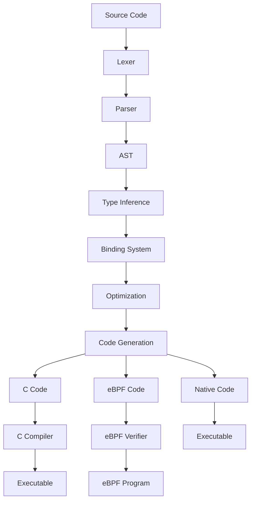

# Compiler Architecture in Eshkol

## Overview of the Compilation Pipeline

Eshkol's compiler architecture is designed for flexibility, performance, and maintainability. The compilation process transforms Eshkol source code into executable programs through several distinct phases.



## Lexing and Parsing

### Lexer

The lexer (implemented in `src/frontend/lexer/lexer.c`) transforms source text into a stream of tokens:

```c
static Token number(Lexer* lexer) {
    while (is_digit(peek(lexer))) {
        advance(lexer);
    }
    
    // Look for a decimal point
    if (peek(lexer) == '.' && is_digit(peek_next(lexer))) {
        // Consume the '.'
        advance(lexer);
        
        while (is_digit(peek(lexer))) {
            advance(lexer);
        }
    }
    
    // Create token
    Token token = make_token(lexer, TOKEN_NUMBER);
    
    // Parse the number value
    char* end;
    const char* start = lexer->start;
    size_t length = token.length;
    
    // Check if it's an integer or float
    bool is_float = false;
    for (size_t i = 0; i < length; i++) {
        if (start[i] == '.') {
            is_float = true;
            break;
        }
    }
    
    if (is_float) {
        token.value.floating = strtod(start, &end);
    } else {
        token.value.integer = strtol(start, &end, 10);
    }
    
    return token;
}
```

### Parser

The parser (implemented in `src/frontend/parser/parser.c`) transforms tokens into an Abstract Syntax Tree (AST):

```c
static AstNode* parse_expression(Parser* parser) {
    // Parse prefix expression
    AstNode* expr = parse_prefix(parser);
    if (!expr) return NULL;
    
    // Parse infix expressions with precedence
    while (!check(parser, TOKEN_EOF) && 
           !check(parser, TOKEN_RIGHT_PAREN) &&
           precedence(parser->current.type) > parser->precedence) {
        expr = parse_infix(parser, expr);
        if (!expr) return NULL;
    }
    
    return expr;
}
```

## Type Inference and Binding

### Type Inference

The type inference system (implemented in `src/frontend/type_inference/`) analyzes the AST to determine types:

```c
static Type* type_inference_infer_node(TypeInferenceContext* context, AstNode* node) {
    assert(context != NULL);
    assert(node != NULL);
    
    // Check if the node is already in the context
    for (size_t i = 0; i < context->count; i++) {
        if (context->nodes[i] == node) {
            return context->inferred_types[i];
        }
    }
    
    // Infer type based on node type
    Type* type = NULL;
    switch (node->type) {
        case AST_INTEGER_LITERAL:
            type = type_integer_create(context->arena, INT_SIZE_DEFAULT);
            break;
        case AST_FLOAT_LITERAL:
            type = type_float_create(context->arena, FLOAT_SIZE_DEFAULT);
            break;
        // Other cases...
    }
    
    // Store inferred type
    type_inference_set_type(context, node, type);
    
    return type;
}
```

### Binding System

The binding system (implemented in `src/frontend/binding/`) tracks variable scopes and references:

```c
uint64_t binding_system_create_binding(BindingSystem* system, uint64_t scope_id, StringId name, BindingFlags flags) {
    assert(system != NULL);
    
    // Generate unique binding ID
    uint64_t binding_id = system->next_binding_id++;
    
    // Add binding to table
    if (system->binding_table.count >= system->binding_table.capacity) {
        // Resize binding table
        size_t new_capacity = system->binding_table.capacity * 2;
        if (new_capacity == 0) new_capacity = 8;
        
        // Allocate new arrays
        uint64_t* new_binding_ids = arena_alloc(system->arena, new_capacity * sizeof(uint64_t));
        uint64_t* new_scope_ids = arena_alloc(system->arena, new_capacity * sizeof(uint64_t));
        StringId* new_names = arena_alloc(system->arena, new_capacity * sizeof(StringId));
        BindingFlags* new_flags = arena_alloc(system->arena, new_capacity * sizeof(BindingFlags));
        
        if (!new_binding_ids || !new_scope_ids || !new_names || !new_flags) {
            return BINDING_ID_INVALID;
        }
        
        // Copy existing bindings
        memcpy(new_binding_ids, system->binding_table.binding_ids, system->binding_table.count * sizeof(uint64_t));
        memcpy(new_scope_ids, system->binding_table.scope_ids, system->binding_table.count * sizeof(uint64_t));
        memcpy(new_names, system->binding_table.names, system->binding_table.count * sizeof(StringId));
        memcpy(new_flags, system->binding_table.flags, system->binding_table.count * sizeof(BindingFlags));
        
        // Update binding table
        system->binding_table.binding_ids = new_binding_ids;
        system->binding_table.scope_ids = new_scope_ids;
        system->binding_table.names = new_names;
        system->binding_table.flags = new_flags;
        system->binding_table.capacity = new_capacity;
    }
    
    // Add binding to table
    system->binding_table.binding_ids[system->binding_table.count] = binding_id;
    system->binding_table.scope_ids[system->binding_table.count] = scope_id;
    system->binding_table.names[system->binding_table.count] = name;
    system->binding_table.flags[system->binding_table.count] = flags;
    system->binding_table.count++;
    
    return binding_id;
}
```

## Optimization

Eshkol performs several optimization passes:

1. **Constant Folding**: Evaluates constant expressions at compile time
2. **Dead Code Elimination**: Removes unreachable code
3. **Function Inlining**: Inlines small functions to reduce call overhead
4. **Tail Call Optimization**: Optimizes tail recursive calls
5. **SIMD Vectorization**: Automatically vectorizes operations on arrays and vectors

## Code Generation

### C Code Generation

The C code generator (implemented in `src/backend/codegen/`) transforms the AST into C code:

```c
bool codegen_generate_expression(CodegenContext* context, const AstNode* node) {
    assert(context != NULL);
    assert(node != NULL);
    
    // Get diagnostics context
    DiagnosticContext* diagnostics = codegen_context_get_diagnostics(context);
    
    // Debug message
    char debug_msg[256];
    snprintf(debug_msg, sizeof(debug_msg), "Generating expression for node type %d", node->type);
    diagnostic_debug(diagnostics, 0, 0, debug_msg);
    
    // Generate code based on node type
    switch (node->type) {
        case AST_INTEGER_LITERAL:
            fprintf(codegen_context_get_output(context), "%ld", node->as.integer_literal.value);
            return true;
            
        case AST_FLOAT_LITERAL:
            fprintf(codegen_context_get_output(context), "%f", node->as.float_literal.value);
            return true;
            
        // Other cases...
    }
    
    return false;
}
```

### eBPF Code Generation

For eBPF targets, Eshkol generates eBPF bytecode or C code compatible with BPF compilers.

## Optimization Techniques

### Inlining

Small functions are inlined to reduce call overhead:

```c
static bool should_inline_function(const AstNode* function) {
    // Check function size
    if (function->as.function.body->as.block.statement_count <= 3) {
        return true;
    }
    
    // Check if function is called only once
    if (function->as.function.call_count == 1) {
        return true;
    }
    
    // Other heuristics...
    
    return false;
}
```

### SIMD Optimization

Vector operations are automatically vectorized using SIMD instructions:

```c
static void vector_f_add_sse(VectorF* result, const VectorF* a, const VectorF* b) {
    assert(result != NULL);
    assert(a != NULL);
    assert(b != NULL);
    assert(a->dim == b->dim);
    assert(result->dim >= a->dim);
    
    size_t i = 0;
    size_t dim = a->dim;
    
    // Process 4 elements at a time using SSE
    for (; i + 3 < dim; i += 4) {
        __m128 va = _mm_load_ps(&a->data[i]);
        __m128 vb = _mm_load_ps(&b->data[i]);
        __m128 vr = _mm_add_ps(va, vb);
        _mm_store_ps(&result->data[i], vr);
    }
    
    // Process remaining elements
    for (; i < dim; i++) {
        result->data[i] = a->data[i] + b->data[i];
    }
}
```

## MCP Tools in Development

The MCP (Meta-Circular Processor) tools are a set of utilities for developing and testing the Eshkol compiler:

1. **Interpreter**: For testing language features without compilation
2. **Debugger**: For debugging Eshkol programs
3. **Profiler**: For identifying performance bottlenecks
4. **Test Generator**: For generating test cases

## Conclusion

Eshkol's compiler architecture provides a flexible and powerful framework for transforming high-level Eshkol code into efficient executables. By separating the compilation process into distinct phases and providing multiple backend targets, it enables a wide range of applications from high-performance computing to systems programming.
