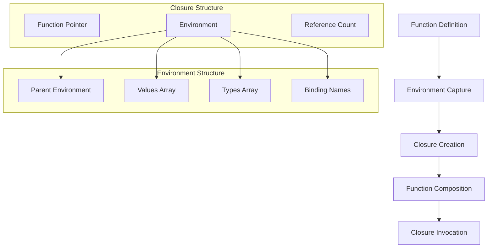

# Function Composition in Eshkol

## Closure System and Function Composition

Eshkol provides a powerful system for function composition and closures, enabling functional programming patterns while maintaining high performance. This document explains how closures are implemented and used in Eshkol.

### Core Concepts



## Closure Implementation

Closures in Eshkol are implemented using the `EshkolClosure` and `EshkolEnvironment` structures:

```c
typedef struct EshkolClosure {
    void* (*function)(void*, void**);  // Function pointer
    EshkolEnvironment* environment;    // Captured environment
} EshkolClosure;

typedef struct EshkolEnvironment {
    struct EshkolEnvironment* parent;  // Parent environment
    void** values;                     // Array of values
    Type** types;                      // Array of types
    size_t value_count;                // Number of values
    size_t capacity;                   // Capacity of arrays
    char** binding_names;              // Names of bindings
    size_t binding_count;              // Number of bindings
    size_t ref_count;                  // Reference count
    bool in_validation;                // Flag for cycle detection
    uint64_t env_id;                   // Unique environment ID
} EshkolEnvironment;
```

## Function Composition Examples

### Basic Function Composition

```scheme
;; Define two simple functions
(define (add1 x) (+ x 1))
(define (square x) (* x x))

;; Compose them in different orders
(define square-then-add1 (compose add1 square))
(define add1-then-square (compose square add1))

;; Usage
(square-then-add1 5)  ; => 26 (add1(square(5)) = add1(25) = 26)
(add1-then-square 5)  ; => 36 (square(add1(5)) = square(6) = 36)
```

### Higher-Order Function Composition

```scheme
;; Higher-order function that returns a composed function
(define (make-multiplier factor)
  (lambda (x) (* x factor)))

;; Create specific multipliers
(define double (make-multiplier 2))
(define triple (make-multiplier 3))

;; Compose with other functions
(define double-then-add1 (compose add1 double))
(define double-then-add1-then-square (compose square double-then-add1))

;; Usage
(double-then-add1 5)               ; => 11 (add1(double(5)) = add1(10) = 11)
(double-then-add1-then-square 5)   ; => 121 (square(add1(double(5))) = square(11) = 121)
```

## Relationship Between Closures and Environments

Closures in Eshkol maintain a reference to their lexical environment, which includes:

1. **Local Variables**: Variables defined in the function's scope
2. **Captured Variables**: Variables from outer scopes
3. **Parent Environment**: Reference to the environment chain

This environment chain allows closures to access variables from their defining scope, even after that scope has exited.

### Environment Management

Environments are reference-counted to ensure proper cleanup:

```c
void eshkol_environment_retain(EshkolEnvironment* env) {
    if (env) {
        env->ref_count++;
    }
}

void eshkol_environment_release(EshkolEnvironment* env) {
    if (env && --env->ref_count == 0) {
        // Release parent environment
        if (env->parent) {
            eshkol_environment_release(env->parent);
        }
        
        // Free arrays
        free(env->values);
        free(env->types);
        free(env->binding_names);
        
        // Free environment
        free(env);
    }
}
```

## Optimization Techniques

Eshkol employs several optimization techniques for function composition:

### 1. Inlining

Simple functions are often inlined at the call site, eliminating function call overhead:

```scheme
;; This composition might be inlined
(define (simple-composition x)
  ((compose add1 square) x))

;; Could be optimized to:
(define (simple-composition x)
  (add1 (square x)))
```

### 2. Partial Evaluation

When some arguments are known at compile time, partial evaluation can pre-compute parts of the function:

```scheme
;; Partial application
(define add5 (partial + 5))

;; Could be optimized to:
(define (add5 x) (+ 5 x))
```

### 3. Tail Call Optimization

Eshkol implements proper tail call optimization, allowing recursive function composition without stack overflow:

```scheme
;; Recursive composition with tail calls
(define (repeat-function f n)
  (if (= n 1)
      f
      (compose f (repeat-function f (- n 1)))))

;; Usage
(define square-5-times (repeat-function square 5))
(square-5-times 2)  ; => 2^32 = 4,294,967,296
```

## Fixed-Size Function Composition

For performance-critical code, Eshkol supports fixed-size function composition arrays:

```c
// Function type definition
typedef int (*FXN)(int);

// Composition functions
int square(int x) { return x * x; }
int add1(int x) { return x + 1; }
int double_value(int x) { return x * 2; }

// Direct composition implementations
int square_then_add1(int x) { return add1(square(x)); }
int add1_then_square(int x) { return square(add1(x)); }
int double_then_add1_then_square(int x) { return square(add1(double_value(x))); }

// Usage
int main() {
    // Create a function array
    FXN fs[] = {square, add1, double_value};
    int size = 3;
    
    // Test the direct implementation
    printf("Testing direct implementation:\n");
    printf("square_then_add1(5) = %d\n", square_then_add1(5));  // 26
    printf("add1_then_square(5) = %d\n", add1_then_square(5));  // 36
    printf("double_then_add1_then_square(5) = %d\n", double_then_add1_then_square(5));  // 121
    
    return 0;
}
```

## Conclusion

Eshkol's function composition system provides the expressiveness of functional programming with the performance of compiled code. By implementing closures with reference-counted environments and applying aggressive optimizations, Eshkol enables efficient functional programming patterns without sacrificing performance.
