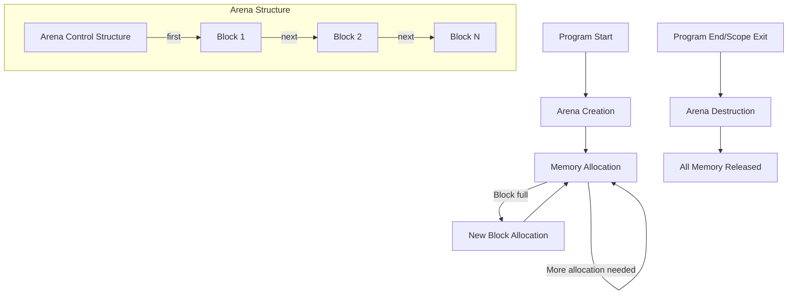

# Memory Management in Eshkol

## Arena-Based Allocation System

Eshkol uses an arena-based memory allocation system that provides efficient, predictable memory management without the overhead of garbage collection. This approach is particularly well-suited for applications where performance and deterministic resource usage are critical.

### Core Concepts



## How Arena Allocation Works

1. **Arena Creation**: At program or scope start, an arena is created with an initial memory block.
2. **Allocation**: Memory is allocated by bumping a pointer within the current block.
3. **Block Expansion**: When a block is full, a new block is allocated (typically twice the size of the previous block).
4. **Deallocation**: Individual objects are not freed; instead, the entire arena is reset or destroyed.

## Arena Implementation

The core of Eshkol's memory management is the `Arena` structure:

```c
typedef struct Block {
    struct Block* next;  // Next block in the list
    size_t size;         // Size of the data area in bytes
    size_t used;         // Number of bytes used in the data area
    uintptr_t data[];    // Flexible array member for the data
} Block;

struct Arena {
    Block* current;          // Current block for allocations
    Block* first;            // First block in the list
    size_t total_used;       // Total bytes used across all blocks
    size_t allocation_count; // Number of allocations made
    size_t min_block_size;   // Minimum block size for new blocks
};
```

### Key Functions

#### Arena Creation

```c
Arena* arena_create(size_t initial_capacity) {
    size_t min_size = 1024;  // Minimum 1KB
    size_t block_size = initial_capacity > min_size ? initial_capacity : min_size;
    
    // Allocate the arena control structure
    Arena* arena = malloc(sizeof(Arena));
    if (!arena) return NULL;
    
    // Allocate the initial block
    size_t header_size = sizeof(Block);
    Block* block = malloc(header_size + block_size);
    if (!block) {
        free(arena);
        return NULL;
    }
    
    // Initialize block
    block->next = NULL;
    block->size = block_size;
    block->used = 0;
    
    // Initialize arena
    arena->current = block;
    arena->first = block;
    arena->total_used = 0;
    arena->allocation_count = 0;
    arena->min_block_size = min_size;
    
    return arena;
}
```

#### Memory Allocation

```c
void* arena_alloc(Arena* arena, size_t size) {
    assert(arena != NULL);
    
    // Handle zero-sized allocations
    if (size == 0) {
        return NULL;
    }
    
    // Align size to ensure proper alignment
    size = (size + 7) & ~7;  // Align to 8 bytes
    
    // Check if there's enough space in the current block
    if (arena->current->used + size > arena->current->size) {
        // Need a new block
        size_t new_block_size = arena->current->size * 2;
        if (new_block_size < size) {
            new_block_size = size;
        }
        
        // Allocate new block
        size_t header_size = sizeof(Block);
        Block* new_block = malloc(header_size + new_block_size);
        if (!new_block) return NULL;
        
        // Initialize new block
        new_block->next = NULL;
        new_block->size = new_block_size;
        new_block->used = 0;
        
        // Link new block
        arena->current->next = new_block;
        arena->current = new_block;
    }
    
    // Allocate from current block
    void* ptr = (char*)arena->current->data + arena->current->used;
    arena->current->used += size;
    arena->total_used += size;
    arena->allocation_count++;
    
    return ptr;
}
```

#### Arena Destruction

```c
void arena_destroy(Arena* arena) {
    if (!arena) return;
    
    // Free all blocks
    Block* block = arena->first;
    while (block) {
        Block* next = block->next;
        free(block);
        block = next;
    }
    
    // Free arena control structure
    free(arena);
}
```

## Benefits of Arena Allocation

1. **Performance**: Allocation is extremely fast (just a pointer bump)
2. **No Fragmentation**: Memory fragmentation is eliminated
3. **Cache Locality**: Related objects are allocated contiguously, improving cache performance
4. **Predictability**: No unpredictable GC pauses
5. **Simplicity**: No complex garbage collection algorithms

## Comparison with Traditional Approaches

| Aspect | Arena Allocation | Garbage Collection | Manual Memory Management |
|--------|-----------------|-------------------|-------------------------|
| Allocation Speed | Very Fast (O(1)) | Fast | Fast |
| Deallocation Speed | Very Fast (O(1)) for entire arena | Varies (can cause pauses) | Fast for individual objects |
| Memory Efficiency | Good for temporary objects | Varies (overhead for tracking) | Excellent (with careful management) |
| Memory Safety | Safe within arena lifetime | Very safe | Prone to leaks and use-after-free |
| Programmer Effort | Low | Very low | High |
| Predictability | Highly predictable | Unpredictable pauses | Predictable |

## Usage Patterns in Eshkol

### Scope-Based Arenas

In Eshkol, arenas are often tied to lexical scopes:

```scheme
(define (process-data data)
  (with-arena (arena 1024)  ; Create a 1KB arena
    (let* ((result (compute-result data arena))
           (formatted (format-result result arena)))
      (display formatted))))  ; Arena is automatically destroyed at scope exit
```

### Long-lived Arenas

For longer-lived objects, Eshkol supports persistent arenas:

```scheme
(define global-arena (make-arena 1024 * 1024))  ; 1MB arena

(define (initialize-system)
  (set! global-data (load-data global-arena))
  (set! global-config (load-config global-arena)))

(define (cleanup-system)
  (destroy-arena global-arena))
```

## Best Practices

1. **Match Arena Lifetimes to Object Lifetimes**: Create arenas for objects with similar lifetimes
2. **Size Appropriately**: Start with a reasonable size based on expected allocations
3. **Reset Instead of Destroy**: Use `arena_reset` for arenas that will be reused
4. **Avoid External References**: Don't store references to arena-allocated objects outside their arena's lifetime
5. **Consider Alignment**: Use `arena_alloc_aligned` for objects requiring specific alignment

## Conclusion

Arena-based memory management is a key feature of Eshkol that provides performance and predictability without sacrificing safety. By eliminating the need for garbage collection or manual memory management, it allows developers to focus on their application logic while still achieving excellent performance characteristics.
