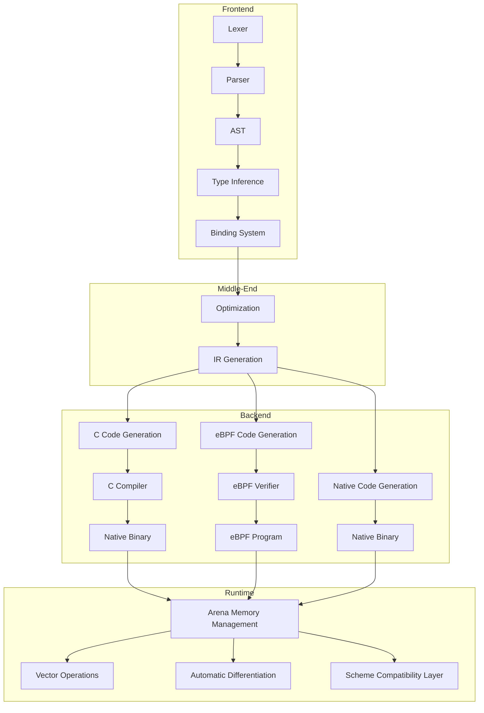

# Eshkol Language Overview

## Core Philosophy and Design Principles

Eshkol is designed around several key principles:

1. **Performance with Safety**: Achieve C-like performance while providing memory safety through arena-based allocation.
2. **Gradual Typing**: Support both dynamic and static typing, allowing developers to add type annotations incrementally.
3. **Scientific Computing**: First-class support for scientific computing with automatic differentiation and vector operations.
4. **Scheme Compatibility**: Maintain compatibility with Scheme (R5RS/R7RS-small) while extending functionality.
5. **Compilation Flexibility**: Support multiple compilation targets including native code, C, and eBPF.

## High-Level Architecture



## Key Features and Capabilities

### Memory Management
- Arena-based allocation for efficient and predictable memory usage
- No garbage collection overhead
- Deterministic resource management

### Type System
- Gradual typing allowing both dynamic and static approaches
- Type inference to reduce annotation burden
- First-class support for scientific types (vectors, matrices, tensors)

### Scientific Computing
- Automatic differentiation for gradient-based optimization
- SIMD-optimized vector and matrix operations
- Support for common scientific computing patterns

### Function Composition
- First-class functions and closures
- Efficient function composition
- Lexical scoping with proper tail calls

### Compilation Targets
- Native code generation for maximum performance
- C code generation for portability
- eBPF code generation for kernel and networking applications

## Combining Scheme Syntax with C Performance

Eshkol achieves the balance between Scheme's expressiveness and C's performance through:

1. **Syntax**: Scheme-like syntax for readability and expressiveness
2. **Compilation**: Ahead-of-time compilation to efficient machine code
3. **Memory Model**: Arena-based allocation instead of garbage collection
4. **Type System**: Optional static typing for performance-critical code
5. **Optimizations**: Aggressive compiler optimizations including inlining and SIMD

### Example: Factorial in Eshkol

```scheme
;; Type declaration (optional)
(: factorial (-> integer integer))

;; Implementation with tail recursion
(define (factorial n)
  (define (fact-iter n acc)
    (if (= n 0)
        acc
        (fact-iter (- n 1) (* n acc))))
  (fact-iter n 1))

;; Usage
(display (factorial 10))
```

This example demonstrates:
- Optional type declarations
- Scheme-like syntax
- Tail recursion optimization
- Efficient compilation to native code

## Use Cases

Eshkol is particularly well-suited for:

1. **Scientific Computing**: Physics simulations, computational biology, etc.
2. **Machine Learning**: Gradient-based optimization, neural networks
3. **Systems Programming**: High-performance system components
4. **Embedded Systems**: Resource-constrained environments
5. **Network Programming**: eBPF programs for networking and observability

## Conclusion

Eshkol represents a unique approach to language design, combining the best aspects of functional programming with systems programming performance. By providing a gradual typing system and arena-based memory management, it offers developers the flexibility to choose the right balance of safety and performance for their specific needs.
