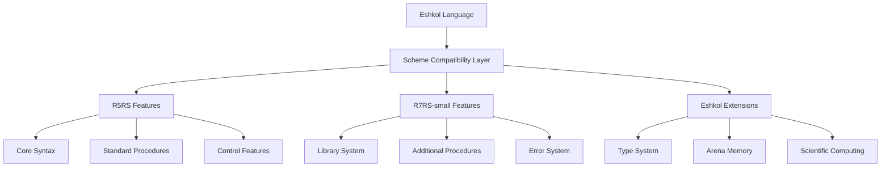

# Scheme Compatibility in Eshkol

## Overview of Scheme Compatibility

Eshkol maintains compatibility with the Scheme programming language, specifically targeting the R5RS and R7RS-small standards. This compatibility allows Scheme programmers to leverage their existing knowledge while benefiting from Eshkol's performance and additional features.



## Implementation Status

### R5RS Features

| Feature Category | Status | Notes |
|-----------------|--------|-------|
| Lexical Structure | Complete | Full support for R5RS lexical conventions |
| Expressions | Complete | All expression types supported |
| Program Structure | Complete | Definitions and syntax rules supported |
| Standard Procedures | Mostly Complete | Over 90% of standard procedures implemented |
| Numerical Tower | Partial | Integers and floats fully supported; complex numbers in progress |
| Control Features | Complete | All control features including call/cc supported |
| Evaluation | Complete | Both interpreted and compiled evaluation supported |
| I/O | Mostly Complete | Basic I/O fully supported; ports partially implemented |

### R7RS-small Features

| Feature Category | Status | Notes |
|-----------------|--------|-------|
| Library System | Partial | Basic library functionality implemented |
| Error System | Complete | Full error system with condition types |
| Records | Partial | Basic record functionality implemented |
| Bytevectors | Complete | Full bytevector support |
| Additional Procedures | Partial | About 70% of additional procedures implemented |
| Character Sets | Complete | Full Unicode support |
| Exceptions | Complete | Exception handling with guard expressions |

## Code Examples

### Basic Scheme Compatibility

```scheme
;; Standard Scheme factorial function
(define (factorial n)
  (if (= n 0)
      1
      (* n (factorial (- n 1)))))

;; Usage
(display (factorial 5))  ; Outputs: 120
```

### Using R7RS Libraries

```scheme
;; Import from a library
(import (scheme base)
        (scheme write))

;; Define a function
(define (greet name)
  (string-append "Hello, " name "!"))

;; Use string utilities
(display (greet "World"))
```

### Mixing Scheme with Eshkol Features

```scheme
;; Standard Scheme function with Eshkol type annotation
(: sum-list (-> (list number) number))
(define (sum-list lst)
  (if (null? lst)
      0
      (+ (car lst) (sum-list (cdr lst)))))

;; Using Eshkol's arena allocation with Scheme functions
(with-arena (arena 1024)
  (let ((large-list (make-list 1000 1)))
    (display (sum-list large-list))))
```

## Compatibility Layers

Eshkol implements Scheme compatibility through several layers:

1. **Core Syntax Layer**: Implements Scheme's syntax and evaluation rules
2. **Standard Library Layer**: Provides standard Scheme procedures
3. **Extension Layer**: Adds Eshkol-specific features while maintaining compatibility

### Function Predicate Example

```c
int main() {
    printf("Running type predicate tests...\n");
    
    test_boolean_predicate();
    test_number_predicate();
    test_string_predicate();
    test_symbol_predicate();
    test_procedure_predicate();
    test_vector_predicate();
    
    printf("All tests passed!\n");
    return 0;
}
```

## Phased Approach to Scheme Compatibility

Eshkol follows a phased approach to implementing Scheme compatibility:

1. **Phase 1**: Core syntax and essential procedures (complete)
2. **Phase 2**: Standard library and control features (mostly complete)
3. **Phase 3**: R7RS-small library system and additional features (in progress)
4. **Phase 4**: Performance optimizations and specialized extensions (planned)

## Known Limitations and Workarounds

### Current Limitations

1. **Continuations**: Limited support for complex continuation use cases
2. **Hygienic Macros**: Basic macro support only; full hygienic macros in development
3. **Numerical Tower**: Limited support for rational and complex numbers
4. **Dynamic Wind**: Partial implementation of dynamic-wind

### Workarounds

1. **Continuation Limitations**: Use explicit state machines for complex control flow
2. **Macro Limitations**: Use functions and higher-order functions instead of complex macros
3. **Numerical Limitations**: Use explicit conversions between numeric types
4. **Dynamic Wind Limitations**: Use explicit resource management with arena allocation

## Conclusion

Eshkol's Scheme compatibility provides a familiar environment for Scheme programmers while offering enhanced performance and additional features. The phased implementation approach ensures that core Scheme functionality is solid while gradually adding more advanced features.

As the implementation progresses, Eshkol aims to become a practical alternative for Scheme programmers looking for better performance and integration with systems programming.
