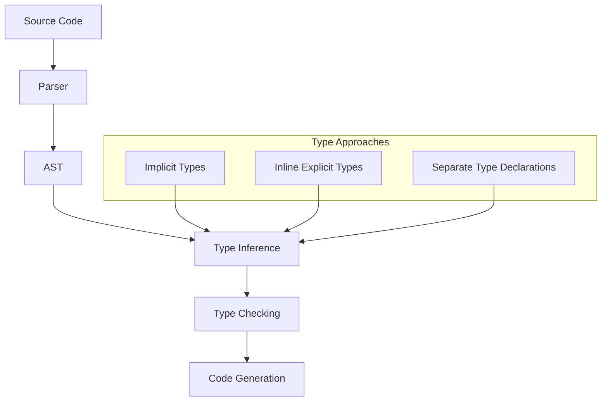

# Type System in Eshkol

## Gradual Typing Approach

Eshkol implements a gradual typing system that allows developers to choose between dynamic typing, static typing, or a mix of both. This flexibility enables rapid prototyping with dynamic typing while allowing performance-critical sections to benefit from static type checking and optimizations.

### Core Concepts



## Three Typing Approaches

### 1. Implicit Typing (Dynamic)

In this approach, types are inferred at compile time but checked at runtime:

```scheme
(define (add-numbers x y)
  (+ x y))

;; Can be called with any types that support addition
(add-numbers 1 2)        ; Works: 3
(add-numbers 1.5 2.5)    ; Works: 4.0
(add-numbers "a" "b")    ; Works if string concatenation is defined
```

### 2. Inline Explicit Typing

Types can be specified directly in function parameters and return values:

```scheme
(define (add-integers [x : integer] [y : integer]) : integer
  (+ x y))

(add-integers 1 2)       ; Works: 3
(add-integers 1.5 2.5)   ; Type error: expected integer, got float
```

### 3. Separate Type Declarations

Types can be declared separately from function definitions:

```scheme
;; Type declaration
(: multiply-floats (-> float float float))

;; Implementation
(define (multiply-floats x y)
  (* x y))

(multiply-floats 1.5 2.0)  ; Works: 3.0
(multiply-floats 1 2)      ; Coerced to float or type error depending on settings
```

## Type Inference Process

Eshkol's type inference system works through several stages:

1. **Local Inference**: Types are inferred from expressions and literals
2. **Constraint Generation**: Type constraints are generated from operations
3. **Constraint Solving**: Constraints are solved to determine most specific types
4. **Generalization**: Type variables are generalized where possible
5. **Specialization**: Generic types are specialized based on usage

## Type Safety and Flexibility

The gradual typing system maintains type safety while preserving flexibility through:

1. **Optional Type Annotations**: Add types where they provide value
2. **Type Boundaries**: Clear boundaries between statically and dynamically typed code
3. **Blame Tracking**: Runtime errors are attributed to the correct boundary violation
4. **Type Coercion**: Automatic coercion between compatible types when safe
5. **Type Refinement**: Types are refined based on runtime checks

## Scientific Computing Types

Eshkol provides first-class support for scientific computing types:

### Vector and Matrix Types

```scheme
;; Vector type declaration
(: gradient (-> (vector float) (vector float)))

;; Matrix operation with explicit types
(define (matrix-multiply [A : (matrix float)] [B : (matrix float)]) : (matrix float)
  (mat-mul A B))
```

### Automatic Differentiation Types

```scheme
;; Dual number type for automatic differentiation
(: gradient-descent (-> (-> (vector float) float) (vector float) float (vector float)))

;; Function that works with differentiable types
(define (optimize f initial-point learning-rate)
  (gradient-descent f initial-point learning-rate))
```

## Type System Implementation

The type system is implemented in the `TypeInferenceContext` structure:

```c
struct TypeInferenceContext {
    Arena* arena;                // Arena for allocations 
    DiagnosticContext* diagnostics; // Diagnostic context for error reporting 
    AstNode** nodes;             // Array of AST nodes 
    Type** inferred_types;       // Array of inferred types 
    size_t capacity;             // Capacity of the arrays 
    size_t count;                // Number of nodes 
    
    // Enhanced type system support
    AstNode** explicit_nodes;    // Array of explicitly typed AST nodes 
    Type** function_signatures;  // Array of function signatures
    StringId* function_names;    // Array of function names
    size_t signature_count;      // Number of function signatures
};
```

## Conclusion

Eshkol's gradual typing system provides the best of both worlds: the flexibility and rapid development of dynamic typing combined with the performance and safety benefits of static typing. By allowing developers to add type annotations incrementally, it supports a wide range of programming styles and use cases.
